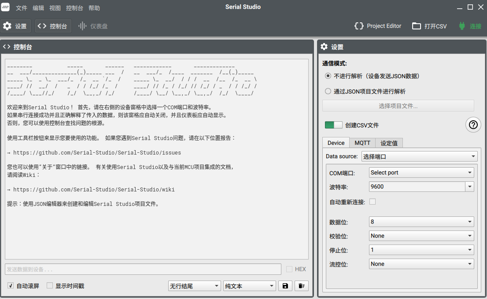
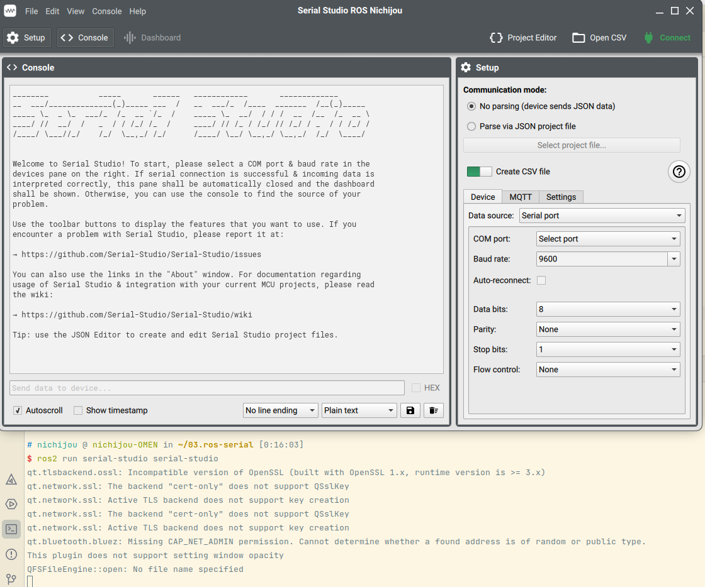

# USER Develop

* 开发流程以及注意事项
* 关于该软件的使用和安装请查看WiKi

## 获取/初步编译工程

* fork 原始工程到https://github.com/zephyrhunt/Serial-Studio-ROS

* 克隆git clone --recursive https://github.com/zephyrhunt/Serial-Studio-ROS

* 创建该README.md文件，并完成一次提交**user develop init**。

* 编译工程
  ```bash
  qmake 
  make -j8
  ```

   注意 qmake 需要注意版本，如果之前安装过其他版本的QT，最好指定qmake绝对路径，如笔者为**/home/nichijou/Qt/6.3.2/gcc_64/bin/qmake**，查看其版本，项目在QT6.3.2下编译而成。
  
  ```bash
  $ /home/nichijou/Qt/6.3.2/gcc_64/bin/qmake --version
  QMake version 3.1
  Using Qt version 6.3.2 in /home/nichijou/Qt/6.3.2/gcc_64/lib
  ```
  
  编译结束后主目录下会现一个可执行文件**serial-studio**，执行该文件，可以打开该软件。
  
  

* 注意
  此时目录下将会有很多很乱的文件，我们现在把他们收到一起，现使用git完全重置到上一次提交。使用**QT Creator**打开进行编译，执行。原始的.pro文件中未添加qml，会有报错，添加即可。

  > QT += qml

## 工程概览

* 参考Serial-Studio [DOXGEN文档](https://serial-studio.github.io/hackers/)

主要关注src文件夹，其中

* **CSV文件夹:** 
  * 包含CSV::Export 和 CSV::Player
* **IO文件夹:** 
  * 包含IO::Manager, IO::DataSources::Serial, IO::DataSources::Network & IO::Console。
  * 其中IO::Manager & IO::Console是单例类，即只有一个实例，外部不会进行额外的实例化。
* **JSON文件夹**:
  * JSON::Frame包含Json的一些信息，frame对象的生成来自连接的设备和JSON映射文件。
  * JSON::Group一组对象。
  * JSON::Dataset数据集对象。
  * JSON::Generator处理来自IO::Manager的数据和JSON映射文件的数据，用来生成frame对象。
  * JSON::FrameInfo...
  * JSON::Editor允许用户在软件上编辑JSON文件。
* **Misc文件夹:**
  * 杂项类，包含一些实用的类。
* **MQTT文件夹**
  * 实现MQTT的功能。
* **Plugins文件夹**
  * 与外部插件交互。
* **UI文件夹**
  * 为QML提供数据的类，使得QML能够表示frame对象。
  * **Widgets文件夹**： 大部分widgets的数据显示都在此处实现。实现基于[Qwt](https://qwt.sourceforge.io/)
* 用户界面基于 QtQuick/QML，QML代码在./assets/qml文件夹中。
* 命名规则在.clang-format中，使用clang-format-all src格式化所有代码。

## 用户开发

### 开发目标

* 额外添加ROS交互
* 添加UI设置功能

### 开发记录

#### qmake转cmake

为了方便ROS的开发，需要把qmake工程转化为cmake工程。

参考脚本qmake2cmake https://www.qt.io/blog/introducing-qmake2cmake 阅读README.md使用

注意使用完脚本生成的CMakeList.txt还存在一点问题。

* 因为安装了ROS，电脑被提前安装了Qt5，需要在cmake中指定具体的Qt的目录。

  > ```cmake
  > set(CMAKE_PREFIX_PATH "/home/nichijou/Qt/6.3.2/gcc_64")
  > ```

* 根据报错对CMakeLists.txt做一些修改，例如RESOURCE ，注释原有的RESOURCE

  > ```cmake
  > qt_add_resources(RESOURCE assets/Resources.qrc)
  > ```

* 此判断会被默认判断为假 if(QWT_CONFIG_____contains_QwtPlot)，需要将其注释，否则会部分文件无法找到。

​		存在问题

*  qt.tlsbackend.ossl: Incompatible version of OpenSSL (built with OpenSSL 1.x, runtime version is >= 3.x)
   qt版本不符合
*  qt.bluetooth.bluez: Missing CAP_NET_ADMIN permission. Cannot determine whether a found address is of random or public type.
   蓝牙权限问题
*  TODO:后续再解决这个问题

#### 将工程设置为ROS2 Pack

一个ros2的pack包需要里面包含package.xml和CMakeLists.txt文件，其中后者在原有的基础上进行修改即可，前者需要复制创建包默认生成的xml文件稍作修改即可。

注意可能会遇到一些奇怪的问题

* target_link_libraries不能同时有带关键字和不带关键字的版本，修改建议，把CMakeLists.txt中所有target_link_libraries中的PRIVATE关键字去除，ROS2的ament_target_dependencies调用的是不带关键字的。去除后发现仍有同样的问题，出现在Qt6CoreMacros.cmake和Qt6QmlMacros.cmake中，此处对源码进行修改，根本原因在于使用了qt_add_executable，这个命令同时执行了add_exectuable和targe_link_libraries，后续可以考虑拆解此处。

  > ```bash
  > CMake Error at CMakeLists.txt:294 (target_link_libraries):
  > The keyword signature for target_link_libraries has already been used with
  > the target "serial-studio".  All uses of target_link_libraries with a
  > target must be either all-keyword or all-plain.
  > The uses of the keyword signature are here:
  > 
  >    * /home/nichijou/Qt/6.3.2/gcc_64/lib/cmake/Qt6Core/Qt6CoreMacros.cmake:538 (target_link_libraries)
  >    * /home/nichijou/Qt/6.3.2/gcc_64/lib/cmake/Qt6Qml/Qt6QmlMacros.cmake:368 (target_link_libraries)
  >    * /home/nichijou/Qt/6.3.2/gcc_64/lib/cmake/Qt6Qml/Qt6QmlMacros.cmake:908 (target_link_libraries)
  > ```

* 编译后source install/setup.zsh报错，无法找到文件。原因为未正确编译或者Install不对

  > ```bash
  > install(TARGETS serial-studio
  >      DESTINATION lib/${PROJECT_NAME})
  > ```

* PROJECT_NAME需要与可执行文件相同。否则会报错

  > ```bash
  > ament_package_xml() package name 'serial-studio' in '/package.xml' does not
  > match current PROJECT_NAME 'serial-stu'.  You must call project() with
  > the same package name before.
  > ```

* 使用ros2 run 执行文件时，报错找不到一些库，还是因为在安装ROS的时候默认安装了QT5需要在环境变量中指定QT6的安装路径。

  > ```bash
  > export LD_LIBRARY_PATH=/home/nichijou/Qt/6.3.2/gcc_64/lib:$LD_LIBRARY_PATH
  > ```

成功执行



#### qml文件分析

Cpp_XX_XX为src/Misc/ModuleManager.cpp下注册的QML Modules

> * main.qml id:app
>   * Windows.MainWindow.qml
>     * ../Panes
>       * Toolbar.qml --
>         * Setup.qml --remove mqtt and setting
>           * Device Mqtt Setting 
>           * add ROS and remove Mqtt Sttting
>         * Dashboard.qml
>         * Console.qml
>         * New Ros2.qml
>     * ../Window
>     * ../Widgets
>     * ../ProjectEditor
>     * ../FramelessWindow
>     * ../PlatformDependent
>       * Menubar.qml -- add ROS2 and remove some useless
>     * 
>   * Windows.about.qml
>   * Windows.CsvPlayer.qml
>   * Windows.ProjectEditor.qml
>   *  ~~Windows.Donate.qml~~
>   * ~~Windows.Acknowledgements.qml~~

